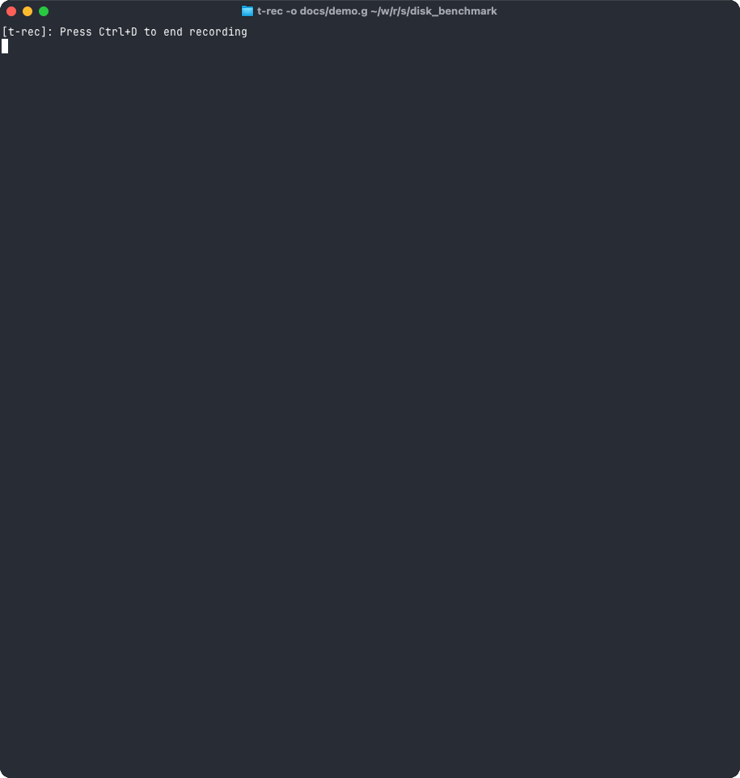

<div align="center">
 
 <h1><strong>SSD Benchmark</strong></h1>

[](https://www.gnu.org/licenses/gpl-3.0)
[](https://crates.io/crates/ssd-benchmark)
[](https://github.com/sassman/ssd-benchmark-rs/actions?query=branch%3Amain+workflow%3ABuild+)
[](https://deps.rs/repo/github/sassman/ssd-benchmark-rs)

</div>

> A super simple disk benchmark tool

inspired by [simple disk benchmark][1].

This tool has just one single purpose, it measures the writing performance of your hard disk on macOS and Linux. More precisely spoken of the disk under your `CWD`.

It used random data and writes first sequentially chunks of 8MB until a total 1GB is written. It measures writing time and throughput.

After that, it writes these random data 8 times again on disk and measures the average writing times and throughput for this.

## Demo



## Quick Start

### Using the docker image

```sh
docker run --rm ghcr.io/sassman/ssd-benchmark-rs
```

### Install on linux

[](https://snapcraft.io/ssd-benchmark)

```sh
sudo snap install ssd-benchmark
```

### Install with cargo

To install the ssd-benchmark tool, you just need to run

```bash
cargo install --force ssd-benchmark
```

(--force just makes it update to the latest version if it's already installed)

to verify if the installation went through, you can run `ssd-benchmark` that should output similar to

```sh
$HOME/.cargo/bin/ssd-benchmark
```

### Usage

```sh
$ ssd-benchmark
  ____    ____    ____                ____                          _                                  _
 / ___|  / ___|  |  _ \              | __ )    ___   _ __     ___  | |__    _ __ ___     __ _   _ __  | | __
 \___ \  \___ \  | | | |    _____    |  _ \   / _ \ | '_ \   / __| | '_ \  | '_ ` _ \   / _` | | '__| | |/ /
  ___) |  ___) | | |_| |   |_____|   | |_) | |  __/ | | | | | (__  | | | | | | | | | | | (_| | | |    |   <
 |____/  |____/  |____/              |____/   \___| |_| |_|  \___| |_| |_| |_| |_| |_|  \__,_| |_|    |_|\_\


Version 1.1.3
Star me on https://github.com/sassman/ssd-benchmark-rs

Filling buffer with 8 MB random data...
Buffer filled                              5426 ms

Start benchmarking your disk writing performance...

Perform sequential writing of total 1024 MB in 8 MB chunks
................................................................

Total time                                 2522 ms
Throughput                               512.00 MB/s

Perform 8 write cycles of 1024 MB
................................................................
................................................................
................................................................
................................................................
................................................................
................................................................
................................................................
................................................................

Total time                                29598 ms
Min write time                             2516 ms
Max write time                             4934 ms
Range write time                           2418 ms
Average write time Ø                       3699 ms
Standard deviation σ                        801 ms

Min throughput                           207.54 MB/s
Max throughput                           407.00 MB/s
Average throughput Ø                     276.83 MB/s
Standard deviation σ                      64.76 MB/s
```

The great thing is, there are no parameters or options.

## Missing something?

If you miss a feature file an issue on [github][2] and don't forget to star the repo.

[1]: http://www.geschke-online.de/sdb/
[2]: https://github.com/sassman/ssd-benchmark-rs/issues